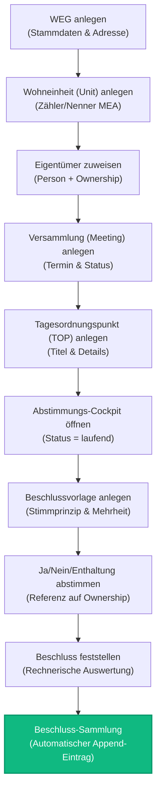

# WEG-Verwaltung Kern-Demo-Workflow

Dieses Dokument beschreibt den belegten Kernworkflow der WEG-Verwaltungssoftware für Wohnungseigentümergemeinschaften (WEG). Er dient als Referenz und Leitfaden für Portfolio-Präsentationen und veranschaulicht die nahtlose Integration von Datenbank-Sicherheitsregeln (RLS, Trigger) mit der Next.js-Benutzeroberfläche.

---

## 1. Überblick über den Workflow

Der Kern-Demo-Workflow deckt die vollständige Kette einer typischen Hausverwaltung ab: von der Stammdatenerfassung bis zur rechtssicheren Protokollierung eines Beschlusses in der gesetzlich vorgeschriebenen Beschluss-Sammlung (§ 24 Abs. 7 WEG).



---

## 2. Detaillierte Workflow-Schritte & Code-Referenzen

### Schritt 1: WEG anlegen
- **UI-Pfad:** `/wegs/new` ([wegs/new/page.tsx](file:///Users/sinanucar/Development/weg-verwaltung/apps/web/src/app/(dashboard)/wegs/new/page.tsx))
- **Beschreibung:** Erfassung des Namens und der postalischen Adresse der WEG.
- **Datenbank-Tabelle:** `public.weg` (geschützt durch RLS: `tenant_id = public.tenant_id()`).

### Schritt 2: Wohneinheit (Unit) anlegen
- **UI-Pfad:** `/wegs/[id]/einheiten/new` ([einheiten/new/page.tsx](file:///Users/sinanucar/Development/weg-verwaltung/apps/web/src/app/(dashboard)/wegs/[id]/einheiten/new/page.tsx))
- **Beschreibung:** Anlage von Sondereigentum (z.B. Wohnung, Stellplatz) inklusive Festlegung der Miteigentumsanteile (MEA) als Bruch (`Zähler` / `Nenner`), um Stimmrechtsgewichte (nach MEA-Prinzip) zu berechnen.
- **Datenbank-Tabelle:** `public.unit`.

### Schritt 3: Eigentümer zuweisen (Person + Ownership)
- **UI-Pfad:** `/wegs/[id]/einheiten/[unitId]/eigentuemerschaft/new` ([eigentuemerschaft/new/page.tsx](file:///Users/sinanucar/Development/weg-verwaltung/apps/web/src/app/(dashboard)/wegs/[id]/einheiten/[unitId]/eigentuemerschaft/new/page.tsx))
- **Beschreibung:** Personen werden als natürliche Personen ohne Login registriert. Die Verknüpfung zu einer Wohnung erfolgt über ein zeitlich begrenztes Eigentumsverhältnis (von/bis). Mehrere Personen können einer Einheit als Co-Eigentümer (Ehepaare etc.) zugeordnet werden.
- **Datenbank-Tabellen:** `public.person` und `public.ownership`.

### Schritt 4: Versammlung (Meeting) anlegen
- **UI-Pfad:** `/wegs/[id]/versammlungen/new` ([versammlungen/new/page.tsx](file:///Users/sinanucar/Development/weg-verwaltung/apps/web/src/app/(dashboard)/wegs/[id]/versammlungen/new/page.tsx))
- **Beschreibung:** Festlegung von Titel, Termin und Veranstaltungsmodus (Präsenz, Hybrid oder rein virtuell gemäß modernem WEG-Recht).
- **Datenbank-Tabelle:** `public.meeting`.

### Schritt 5: Tagesordnungspunkt (TOP) anlegen
- **UI-Pfad:** `/versammlungen/[id]/tops/new` ([tops/new/page.tsx](file:///Users/sinanucar/Development/weg-verwaltung/apps/web/src/app/(dashboard)/versammlungen/[id]/tops/new/page.tsx))
- **Beschreibung:** Formulierung des konkreten Themas (z.B. "Sanierung des Flurfensters"), das während der Versammlung erörtert und abgestimmt wird.
- **Datenbank-Tabelle:** `public.agenda_item`.

### Schritt 6: Abstimmungs-Cockpit öffnen & Versammlungsstart
- **UI-Pfad:** `/tops/[id]/abstimmung`
- **Beschreibung:** Sobald das Meeting auf den Status `laufend` gesetzt wird, ist das Abstimmungs-Cockpit freigeschaltet. Hier werden alle stimmberechtigten Einheiten und deren aktuelle Eigentümer aufgelistet.

### Schritt 7: Beschlussvorlage anlegen
- **UI-Pfad:** `/tops/[id]/abstimmung` (Klick auf "Beschlussvorlage anlegen")
- **Beschreibung:** Eingabe des Beschlusstextes und Auswahl des Stimmprinzips (z.B. Kopfstimmprinzip: eine Stimme pro Einheit; oder Wertprinzip: Gewichtung nach MEA) sowie des Mehrheitstyps (einfach, qualifiziert etc.).
- **Datenbank-Tabelle:** `public.resolution`.

### Schritt 8: Stimmabgabe (Voting)
- **UI-Pfad:** `/tops/[id]/abstimmung`
- **Beschreibung:** Der Verwalter trägt die Stimmen (Ja / Nein / Enthaltung) der anwesenden Eigentümer ein.
- **Datenbank-Tabelle:** `public.vote`.
- **Wichtige Invariante:** Die Stimme referenziert die `ownership_id` des damaligen Eigentumsverhältnisses, niemals die `person_id` oder `user_id`. Dies sichert die historische Korrektheit bei nachträglichem Eigentumswechsel.

### Schritt 9: Beschluss feststellen
- **UI-Pfad:** `/tops/[id]/abstimmung` (Klick auf "Beschluss feststellen")
- **Beschreibung:** Nach der Stimmenzählung stellt der Verwalter das Ergebnis fest. Die Software berechnet automatisch, ob die nötige Mehrheit erreicht wurde.
- **Datenbank-Aktion:** Setzt das Flag `festgestellt_am` in der Tabelle `public.resolution`.

### Schritt 10: Automatischer Eintrag in die Beschluss-Sammlung
- **UI-Pfad:** `/wegs/[id]/beschluss-sammlung` ([beschluss-sammlung/page.tsx](file:///Users/sinanucar/Development/weg-verwaltung/apps/web/src/app/(dashboard)/wegs/[id]/beschluss-sammlung/page.tsx))
- **Beschreibung:** Gesetzlich verpflichtend muss jeder festgestellte Beschluss in die Beschluss-Sammlung eingetragen werden.
- **Datenbank-Trigger:** Ein PostgreSQL-Trigger fängt die Feststellung der Resolution ab und erzeugt vollautomatisch einen fälschungssicheren, nicht-editierbaren Eintrag in `public.beschluss_sammlung_entry`.
- **Wichtige Invariante:** `public.beschluss_sammlung_entry` ist absolut *append-only*. Datenbank-Trigger blockieren jegliche `UPDATE`- oder `DELETE`-Befehle auf dieser Tabelle.

---

## 3. Sicherheits- & Datenschutz-Invarianten

Bei allen Interaktionen stellt die Plattform folgende Invarianten auf Datenbankebene sicher:

1. **Mandantentrennung (Tenant-Isolation):**
   Alle Tabellen besitzen eine Spalte `tenant_id`. Durch PostgreSQL Row Level Security (RLS) wird erzwungen, dass Benutzer nur Daten ihres eigenen Tenants lesen und schreiben können (`tenant_id = public.tenant_id()`).
2. **KI-Schreibsperre (Suggestion-Only):**
   Künstliche Intelligenz (Agenten) darf niemals direkt kritische Daten schreiben. Datenbank-Trigger blockieren das Einfügen oder Ändern von Stimmen, Protokollen oder Beschlüssen, falls der Actor als `agent` markiert ist.
3. **Revisionssicheres Audit-Log:**
   Jede zustandsändernde Tabellen-Operation wird in die Tabelle `public.audit_event` geschrieben. Diese Tabelle ist physisch partitioniert, append-only und kryptografisch per HMAC v2 (über Metadaten und Payload) gesichert.

---

## 4. Ausführung des Demo-Szenarios

Das Demo-Szenario kann vollautomatisch und visuell im Browser wiedergegeben werden.

### Voraussetzungen
1. Das Next.js-Frontend muss lokal gebaut oder gestartet werden:
   ```bash
   just dev-web
   ```
2. Die Datenbank-Migrationen müssen auf dem neuesten Stand sein (automatisch bei Cloud-Verbindung).

### Ausführung
Starte den Playwright-Demo-Test im headed (sichtbaren) Modus, um den Ablauf live zu verfolgen:
```bash
pnpm --filter @weg-verwaltung/web exec playwright test e2e/demo.spec.ts --project=chromium --headed
```

Eine aufgezeichnete Version dieses Durchlaufs ist als Screencast-Artefakt verfügbar (siehe `walkthrough.md` für Details).
